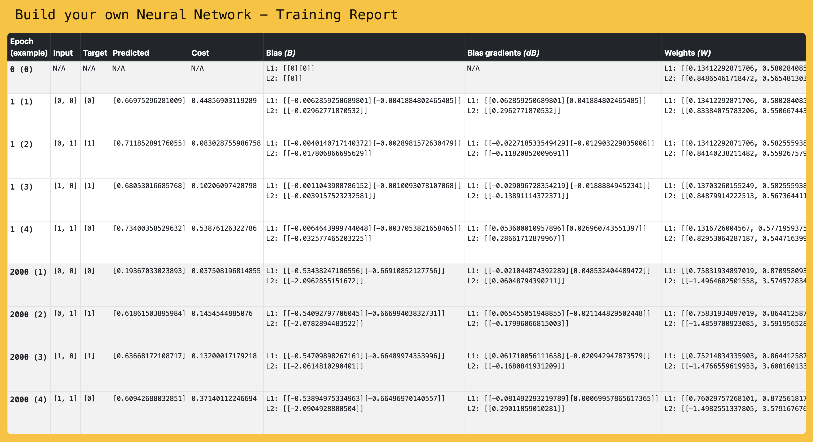

# Build Your Own Neural Network

Support material for the [Build your own Neural Network, with PHP!](https://joind.in/talk/7f337) talk.

## Requirements

* Docker and Docker Compose
* PHP 7

## Installation

With Docker:

```
$ docker-compose build
```

or (PHP and Composer installed on the host):

```
$ composer install
```

## Usage

Included is an example with a Neural Network configured to solve an XOR:

```php
#!/usr/bin/env php
<?php

require_once __DIR__ . '/../vendor/autoload.php';

use Noiselabs\Byonn\Activation;
use Noiselabs\Byonn\CostFunction;
use Noiselabs\Byonn\Debug\Debugger;
use Noiselabs\Byonn\Initializer;
use Noiselabs\Byonn\Optimizer;
use Noiselabs\Byonn\TrainingSet;
use Noiselabs\Byonn\Topology;
use Noiselabs\Byonn\NeuralNetwork;

$xorTrainingSet = new TrainingSet(
    [[0, 0], [0, 1], [1, 0], [1, 1]],
    [0, 1, 1, 0]
);

$neuralNetwork = new NeuralNetwork(
    new Topology([2, 2, 1], [
        new Activation\Sigmoid(),
        new Activation\Sigmoid(),
    ]),
    new Initializer\ParametersInitializer(
        new Initializer\Zeros(),
        new Initializer\RandomUniform(0, 1)
    ),
    new Optimizer\GradientDescent(0.1),
    new CostFunction\MeanSquaredError()
);

$neuralNetwork->train($xorTrainingSet, 20000, 0.01);
```

To run the XOR example do:

```
$ docker-compose run byonn examples/xor.php
Training for 20000 epochs or until the cost falls below 0.010000...

* Epoch: 100, Error: 0.255492
* Epoch: 200, Error: 0.255405
* Epoch: 300, Error: 0.255290
* Epoch: 400, Error: 0.255123
* Epoch: 500, Error: 0.254865
* Epoch: 600, Error: 0.254448
* Epoch: 700, Error: 0.253756
* Epoch: 800, Error: 0.252605
* Epoch: 900, Error: 0.250739
* Epoch: 1000, Error: 0.247854
* Epoch: 1100, Error: 0.243657
* Epoch: 1200, Error: 0.237923
* Epoch: 1300, Error: 0.230646
* Epoch: 1400, Error: 0.222266
* Epoch: 1500, Error: 0.213619
* Epoch: 1600, Error: 0.205390
* Epoch: 1700, Error: 0.197623
* Epoch: 1800, Error: 0.189829
* Epoch: 1900, Error: 0.181427
* Epoch: 2000, Error: 0.171591
* Epoch: 2100, Error: 0.158625
* Epoch: 2200, Error: 0.140188
* Epoch: 2300, Error: 0.115453
* Epoch: 2400, Error: 0.088116
* Epoch: 2500, Error: 0.064397
* Epoch: 2600, Error: 0.047156
* Epoch: 2700, Error: 0.035515
* Epoch: 2800, Error: 0.027689
* Epoch: 2900, Error: 0.022291
* Epoch: 3000, Error: 0.018439
* Epoch: 3100, Error: 0.015599
* Epoch: 3200, Error: 0.013442
* Epoch: 3300, Error: 0.011760
* Epoch: 3400, Error: 0.010419

...done.
Epochs: 3437, Error: 0.009991 (took 11.00 seconds).

Predictions:
* Input: [0, 0], Predicted: 0.095753662872186, Expected: 0 [passed]
* Input: [0, 1], Predicted: 0.90347433019157, Expected: 1 [passed]
* Input: [1, 0], Predicted: 0.90289800056285, Expected: 1 [passed]
* Input: [1, 1], Predicted: 0.10851568961942, Expected: 0 [passed]
Accuracy: 100%                                           
```

or without Docker:


```
$ php examples/xor.php
...
```

And to help you debug your network a report gets generated after each run in the `build` folder.



Have fun!

## Copyright

Copyright (c) 2018 [Vítor Brandão](https://noiselabs.io). Licensed under the [MIT License](LICENSE).


